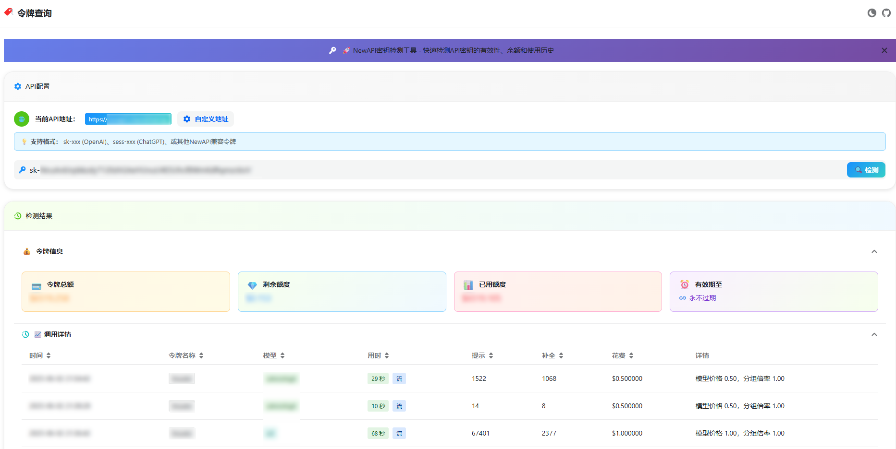

> 该项目需配合NewAPI才能正常使用：[https://github.com/Calcium-Ion/new-api](https://github.com/Calcium-Ion/new-api)

<div align="center">

<h1 align="center">Neko API Key Tool</h1>

NewAPI 令牌查询页

[](https://vercel.com/new/clone?repository-url=https%3A%2F%2Fgithub.com%2FAI-ASS%2Fneko-api-key-tool&env=REACT_APP_SHOW_DETAIL&env=REACT_APP_SHOW_BALANCE&env=REACT_APP_BASE_URL&env=REACT_APP_SHOW_ICONGITHUB&project-name=neko-api-key-tool&repository-name=neko-api-key-tool)

</div>




### 使用方法

#### Vercel 部署
1. 准备好你的 [NewAPI项目](https://github.com/Calcium-Ion/new-api);
2. 点击右侧按钮开始部署：
   [](https://vercel.com/new/clone?repository-url=https%3A%2F%2Fgithub.com%2FAI-ASS%2Fneko-api-key-tool&env=REACT_APP_SHOW_DETAIL&env=REACT_APP_SHOW_BALANCE&env=REACT_APP_BASE_URL&env=REACT_APP_SHOW_ICONGITHUB&project-name=neko-api-key-tool&repository-name=neko-api-key-tool)，直接使用 Github 账号登录即可，记得根据自己需求配置环境变量，环境变量如下： 

```   
REACT_APP_SHOW_BALANCE: 是否展示令牌信息，true 或 false
REACT_APP_SHOW_DETAIL: 是否展示调用详情，true 或 false
REACT_APP_BASE_URL: 你的NewAPI项目地址
REACT_APP_SHOW_ICONGITHUB: 是否展示Github图标，true 或 false
```

例如如下配置：
```
# 展示令牌信息
REACT_APP_SHOW_BALANCE=true

# 展示调用详情
REACT_APP_SHOW_DETAIL=true

# NewAPI的BaseURL（支持多个NewAPI站点聚合查询，键值对中的键为站点名称，值为站点的URL）
# 也可以是简单的URL字符串，如：REACT_APP_BASE_URL=https://your-newapi-domain.com
REACT_APP_BASE_URL={"server1": "https://nekoapi.com", "server2": "https://gf.nekoapi.com"}

# 展示GitHub图标
REACT_APP_SHOW_ICONGITHUB=true
```

3. 部署完毕后，即可开始使用；
4. （可选）[绑定自定义域名](https://vercel.com/docs/concepts/projects/domains/add-a-domain)：Vercel 分配的域名 DNS 在某些区域被污染了，绑定自定义域名即可直连。

### 新功能特性
- **页面内自定义BASE_URL**：支持在页面中动态添加和管理NewAPI服务器地址，无需重新部署
- **多服务器支持**：可以添加多个NewAPI服务器，通过标签页切换查询不同服务器
- **增强的错误处理**：更好的错误边界处理，防止页面白屏
- **兼容最新NewAPI**：适配了NewAPI最新版本的API接口

#### Docker 部署
1. 克隆项目到本地:
```bash
git clone https://github.com/AI-ASS/neko-api-key-tool.git
cd neko-api-key-tool
```

2. 创建并配置环境变量文件:
```bash
# 复制.env.example文件为.env
cp .env.example .env
# 根据自己需求配置env文件中的环境变量
vim .env
```

3. 构建并运行 Docker 容器:
```bash
# 构建镜像
docker build -t neko-api-key-tool .

# 运行容器
docker run -d -p 80:80 --name neko-api-key-tool neko-api-key-tool
```

### 二次开发
复制.env.example文件为.env，根据自己需求配置env文件中的环境变量。
